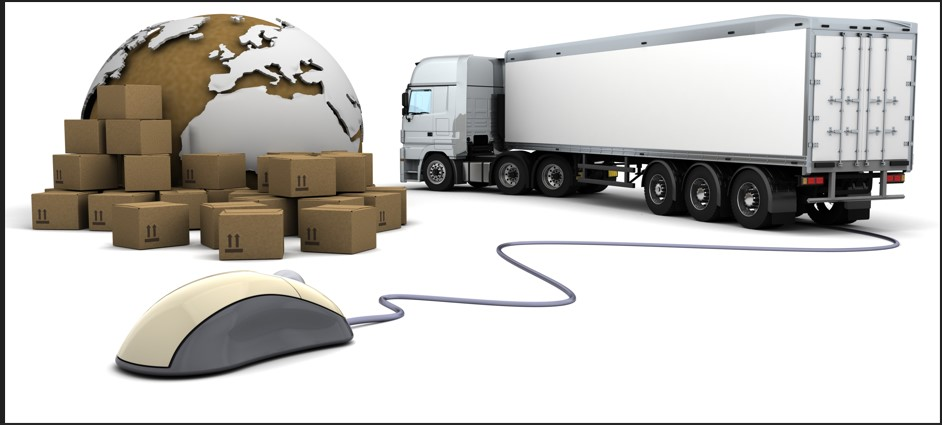
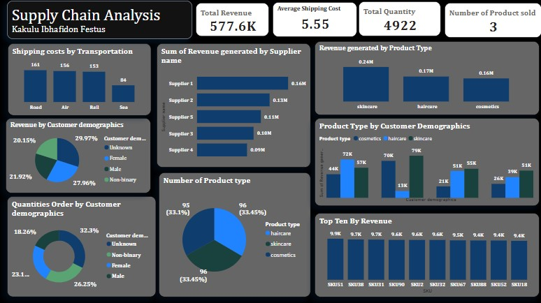

# Supply Chain Analysis

---
# Introduction
We are your trusted partner in end-to-end supply chain solutions. We specialize in streamlining logistics, optimizing operations, and delivering seamless, cost-effective supply chain services that drive growth and efficiency. Whether you're moving goods across the country or around the globe, we're here to make your supply chain smarter and stronger.

# Problem Statement:
The supply chain across 
- Air
- Rail
- Road and
- Sea, faces significant challenges including delays, rising costs, limited visibility, and poor coordination between transport modes. These issues lead to inefficiencies, missed deadlines, and reduced customer satisfaction, highlighting the need for an integrated and streamlined multi-modal logistics solution.

# Skills/Consepts demostrated
The followin Power BI were incorporated:
- DAX
- Modelling
- filters
- quick measures

# Modelling
Automatically derived reletionship in the modelling tab

# Visualization
.

  
  
